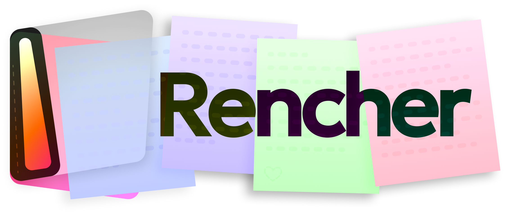

# Rencher - yet another mod manager

	

Rencher is a Ren'Py game manager, made with DDLC mods in mind
 
it strives to be as simple as possible, while being as beautiful as possible

[link to the trello board](https://trello.com/b/CGaqf0xx/rencher)
 

	
	

[//]: # (	)
[//]: # (	)

## download!
### [Windows](https://github.com/danatationn/Rencher/releases/latest/download/RencherInstaller.exe) - [Linux](https://github.com/danatationn/Rencher/releases/latest/download/Rencher-x86_64.AppImage) - ~~macOS~~ (soon)

## tips
* you can turn the update toasts in the settings ^^
* you can also delete the .zip files after importing. also in the settings
* if you're importing an already set up DDLC mod, then just import it normally

## possible upcoming features
- [ ] store (vndb, itch.io, the old DDMC mod list thing)
- [ ] asset viewer (unrpa + unrpyc)
- [ ] Discord RPC
- [ ] more...

## compiling
### Linux

 
 normal 

> [!WARNING]
> Ubuntu 24.04 has an out of date libadwaita package. the only way to build it there is with the Docker method
1. make sure you have `python3` installed	
2. run `build-aux/install_deps.py`
   * this tries to install all Linux and Python packages necessary for building and running
3. run `build-aux/freeze.py`
   * this will spit out an executable with some folders in `build/`
4. (optional) run `build-aux/appimage.py`
   * this will spit out a one file AppImage, meaning you don't have to carry around the folders
5. done! retrieve your execs from `build/`

 
 Docker 

1. make sure you have Docker set up properly (can be tricky!)
2. run these commands:
	1. `docker buildx build -t rencher-builder .`
	2. `docker create --name temp-container rencher-builder`
	3. `docker cp temp-container:/app/build/ ./output/`
	4. `docker rm temp-container`
3. done! retrieve your execs from `output/`

### Windows

 
 The Only Way 

1. make sure you have MSYS2 installed
2. boot into MSYS2 UCRT64 (important!!)
3. run `build-aux/install_deps.py`
	* this tries to install all MSYS2 and Python packages necessary for building and running
4. run `build-aux/freeze.py`
	* this will spit out an executable with some folders in `build/`
5. (optional) run `makensis build-aux/build_installer.nsi`
	* this will spit out an installer for rencher in `build/`

## credits and license

[Nicotine+](https://github.com/nicotine-plus/nicotine-plus) for being made in Python and using GTK. this being open source really helped me with packaging this
 
logo made by my good man [vl1](https://vl1.neocities.org/). check him out!
 
this project is under the [GPL-3](https://github.com/danatationn/rencher?tab=GPL-3.0-1-ov-file)

#### © 2025 danatationn