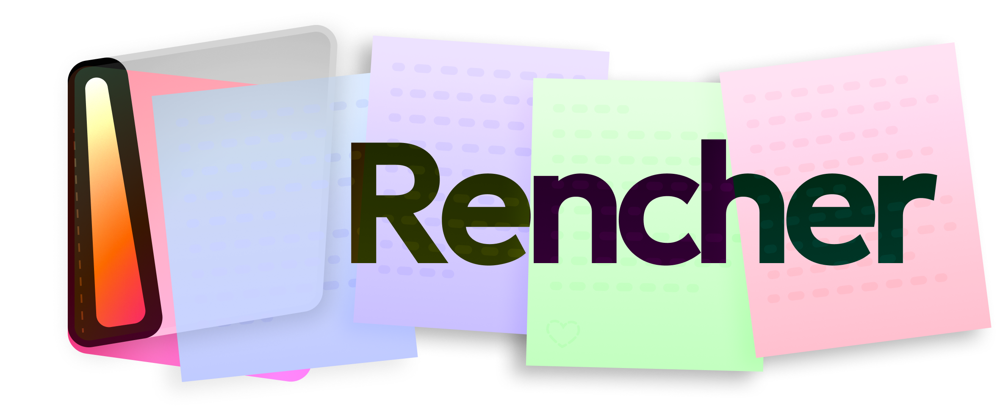

# Rencher - yet another mod manager

	

Rencher is a Ren'Py game manager, made with DDLC mods in mind
 
it strives to be as simple as possible, while being as beautiful as possible

[link to the trello board](https://trello.com/b/CGaqf0xx/rencher)
 

	
	

[//]: # (	)
[//]: # (	)

## download!
### [Windows](https://github.com/danatationn/Rencher/releases/latest/download/RencherInstaller.exe) - [Linux](https://github.com/danatationn/Rencher/releases/latest/download/Rencher.flatpak)

## tips
* you can turn the update toasts in the settings
* you can also delete the .zip files after importing. also in the settings
* if you're importing an already set up DDLC mod, then just import it normally

## possible upcoming features
- [x] Discord RPC
- [ ] asset viewer (unrpa + unrpyc)
- [ ] store (vndb, itch.io, the old DDMC mod list thing)
- [ ] more...

## testing / building
### Linux
1. `uv sync`
2. `meson setup build --prefix $(pwd)/build/root`
3. `ninja -C install`

 
 Flatpak 

`flatpak-builder --install --user build/flatpak com.github.danatationn.rencher.yml` 
* running the flatpak

	`flatpak run com.github.danatationn.rencher`
* exporting as .flatpak	

	`flatpak build-bundle ~/.local/share/flatpak/repo Rencher.flatpak com.github.danatationn.rencher`

### Windows
* setting up the environment
	1. install [msys2](https://www.msys2.org/)
	2. launch msys2 ucrt64
	3. `pacman -Sy mingw-w64-ucrt-x86_64-python\
            mingw-w64-ucrt-x86_64-python-pip\
            mingw-w64-ucrt-x86_64-uv\
            mingw-w64-ucrt-x86_64-meson\
            mingw-w64-ucrt-x86_64-gtk4\
            mingw-w64-ucrt-x86_64-gobject-introspection\
            mingw-w64-ucrt-x86_64-libadwaita\
            mingw-w64-ucrt-x86_64-blueprint-compiler\
            mingw-w64-ucrt-x86_64-cmake\
            mingw-w64-ucrt-x86_64-gcc\
            mingw-w64-ucrt-x86_64-python-cx-freeze\
            mingw-w64-ucrt-x86_64-nsis\`
	4. `git clone https://github.com/danatationn/rencher`
	5. `cd rencher`
	6. `uv sync`
	7. `meson setup build --prefix $(pwd)/build/root`
	8. `ninja -C install`

* freezing (python to exe)

	`ninja -C build freeze`

* making the installer

	`ninja -C build makensis`

### Universal

* running rencher within meson

	`ninja -C build run` or `ninja -C build dev` if you want debug logs

## credits and license

[Nicotine+](https://github.com/nicotine-plus/nicotine-plus) was used as reference for what i should do regarding pygobject and packaging
 
logo made by [vl1](https://vl1.neocities.org/). check him out!
 
this project is under the [GPL-3](https://github.com/danatationn/rencher?tab=GPL-3.0-1-ov-file)

#### © 2025 danatationn
